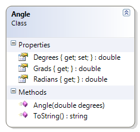

# Topic E

## Demo Classes

### Circle

This class represents a simple circle of a specified diameter. The radius, area and circumference are calculated. 

**Problem Statement**

Write the code for the Circle class. The solution must meet the following requirements:

* Should get and set the diameter
* Should calculate the area, radius, and circumference

Use the following class diagram when creating your solution.

### Square

This class represents a simple square with a specified length for its side. The area and perimeter are calculated. 

**Problem Statement**

Write the code for the Square class. The solution must meet the following requirements:

* Should get and set the length of the side of the square
* Should calculate the area and perimeter

Use the following class diagram when creating your solution.

### Angle

This class represents an angle and provides the value in the following units: degrees, radians and grads. It also gives a simple example of unicode characters (for degrees).

**Problem Statement**

Write the code for the Angle class. The solution must meet the following requirements:

* Should get and set the angle's value (in degrees)
* Should calculate the equivalent angle in Radians and Grads, using the following formulas:
* Radians = Degrees * (π / 180)
* Grads = Radians * (200 / π)
* Should override the ToString() method to return the angle in degrees, in the following format:
* degrees°
* The Unicode character for the degrees symbol (°) is '\u00B0'

Use the following class diagram when creating your solution.

