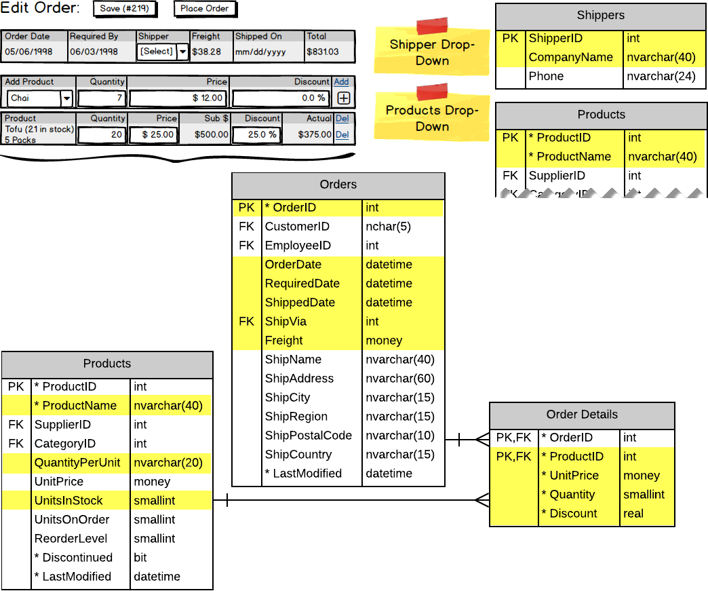

### Query Responsibility

Loading the form with an order populates the summary and detail information. This information is obtained from a single call to the BLL, which retrieves a DTO constructed from parts of the entities. Drop-downs use the same general-purpose POCO as was used earlier when displaying customers.

> 

The DTO/POCO used for populating the order summary/details uses the following classes.

```csharp
public class CustomerOrderWithDetails : CustomerOrder
{
    public IEnumerable<CustomerOrderItem> Details { get; set; }
        = new List<CustomerOrderItem>();
}
```

```csharp
public class CustomerOrderItem : ProductItem
{
    public int OrderId { get; set; }
    public short Quantity { get; set; }
    public float DiscountPercent { get; set; }
}
```

```csharp
public class ProductItem
{
    public int ProductId { get; set; }
    public string ProductName { get; set; }
    public string QuantityPerUnit { get; set; }
    public decimal UnitPrice { get; set; }
    public short? InStockQuantity { get; set; }
}
```

You may notice that the `ProductItem` is the base class for the `CustomerOrderItem`. This class inheritance was introduced because the `ProductItem` information is needed in another code-behind query - the one used to add items to the order.