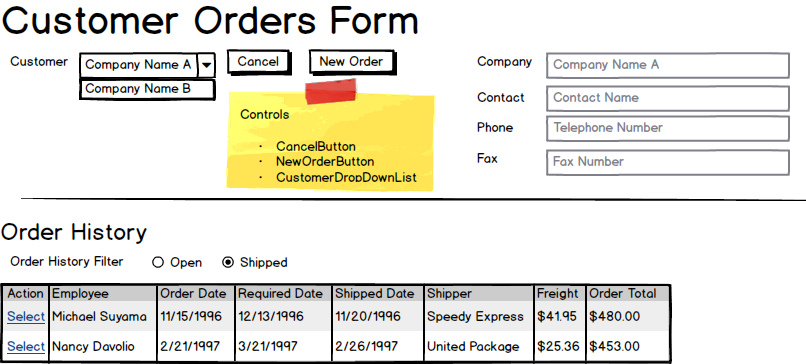
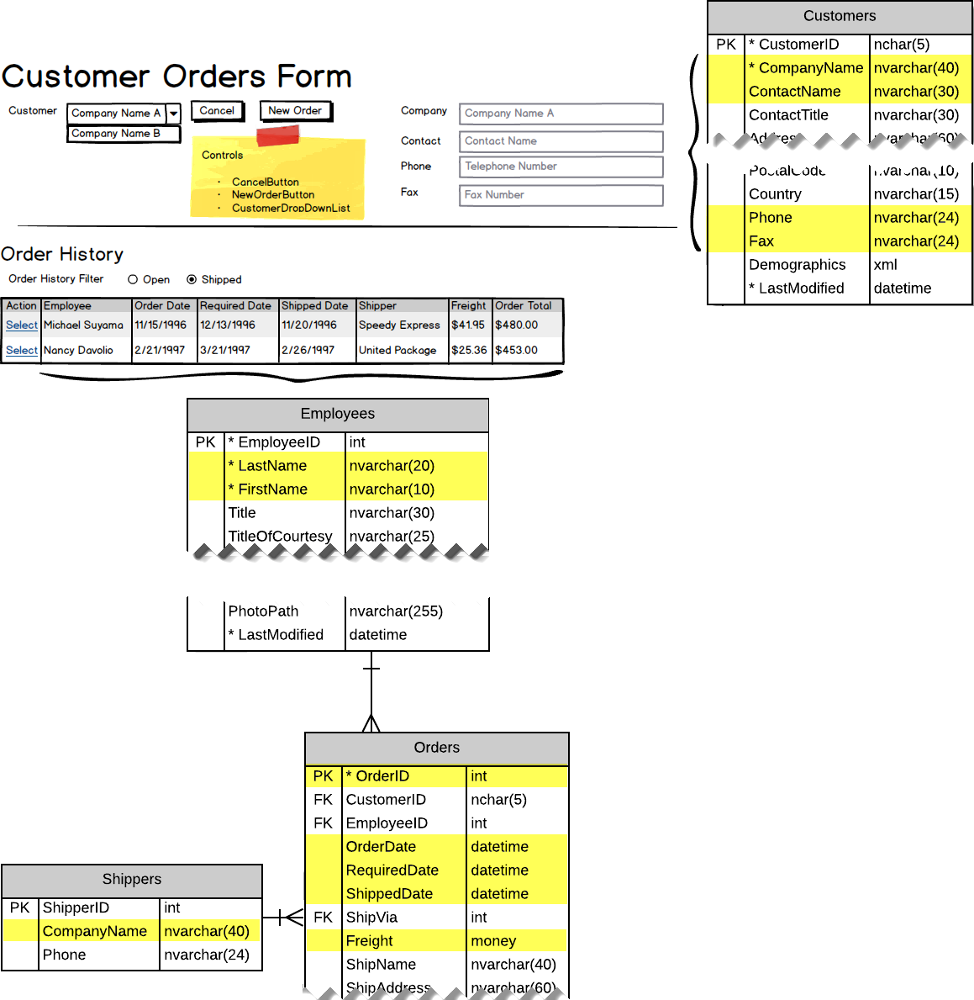

## Selected Customer

When a customer is selected, the general company information is displayed, along with the order history of the customer. Order history is divided into two sets - Orders that have been shipped, and orders that have not been shipped (i.e.: "Open" orders).

> 

When querying the database for this information, it quickly becomes clear that POCOs/DTOs are the most appropriate way to send information to the form.

> 

General customer information can be represented by a simple POCO, and the data is retrieved via code-behind. Part of the reason for this is that the data must be un-packed manually in the code-behind, since it is a *single* customer whose information is retrieved.

```csharp
public class CustomerSummary
{
    public string CompanyName { get; set; }
    public string ContactName { get; set; }
    public string Phone { get; set; }
    public string Fax { get; set; }
}
```

Likewise, each line of the order history details can also be represented by a simple POCO. In this case, however, the data can be retrieved either manually in code-behind or through an `<asp:ObjectDataSource>` control.

```csharp
public class CustomerOrder
{
    public int OrderId { get; set; }
    public string Employee { get; set; }
    public DateTime? OrderDate { get; set; }
    public DateTime? RequiredDate { get; set; }
    public DateTime? ShippedDate { get; set; }
    public string Shipper { get; set; }
    public decimal? Freight { get; set; }
    public decimal OrderTotal { get; set; }
}
```
