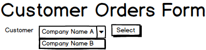
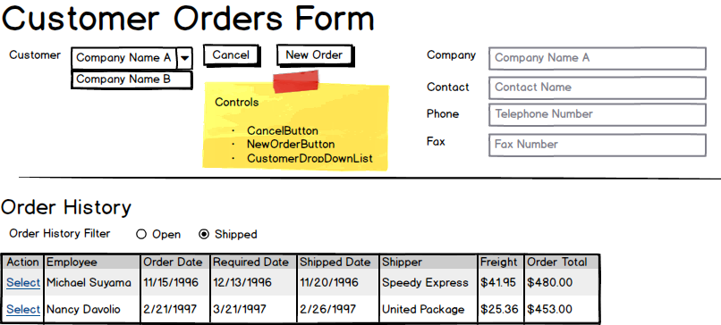
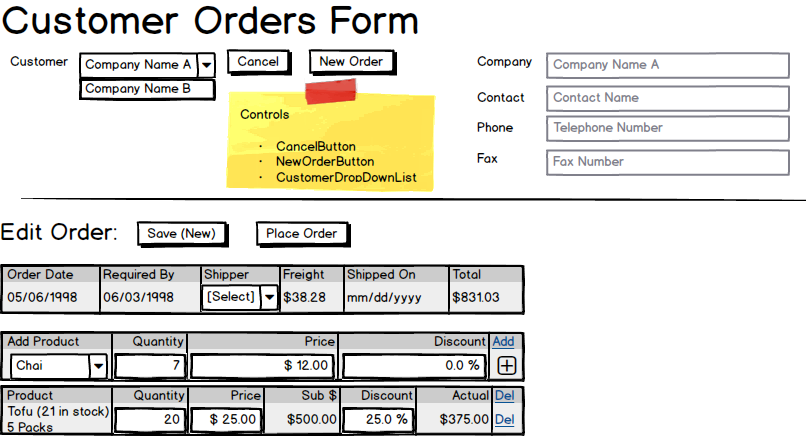

# Customer Orders

The customers of Northwind Traders place their orders by phone or fax. Employees then enter the details of the order into the system via the **Customer Order Form** (from the *Sales* menu item on the website).

The form allows employees to create new orders and view previous orders. Any order whose *Order Date* has been set cannot be modified, because that order has been *"Placed"*.

An order without an Order Date can be modified. It may be an order that is *"In Progress"* (saved, but not placed), or an entirely new order.

The following screen mockups describe the planned user experience (UX) in working with the form.

> Screenshots here, with captions/titles....

## Open the Sales Page

The first visit to the Sales page simply displays a list of existing customers the the employee can select from to view the customer's order history or to create a new order for the customer.

## Selected Customer

When a customer is selected, the general company information is displayed, along with the order history of the customer. Order history is divided into two set - Orders that have been shipped, and orders that have not been shipped (i.e.: "Open" orders).

## Edit New/Existing Order

When editing a new or existing order, **summary information** on the order needs to be available (relevant dates, shipping info, order total) as well as **detail information** on the order items.

If the order is new or **not placed**, then the order can be edited and saved. Once an order is placed (i.e., the *Order Date* is set), then the order cannot be edited. This makes the form helpful for viewing details of placed orders (shipped or not shipped) while protecting the data from being inadvertantly changed.

