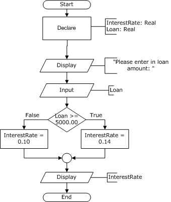
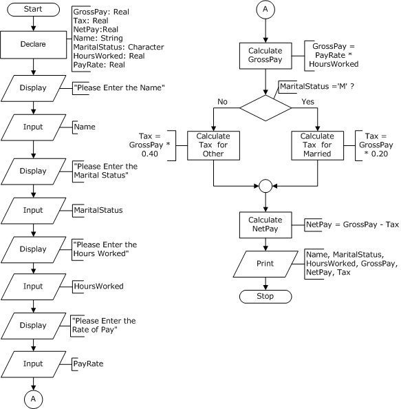
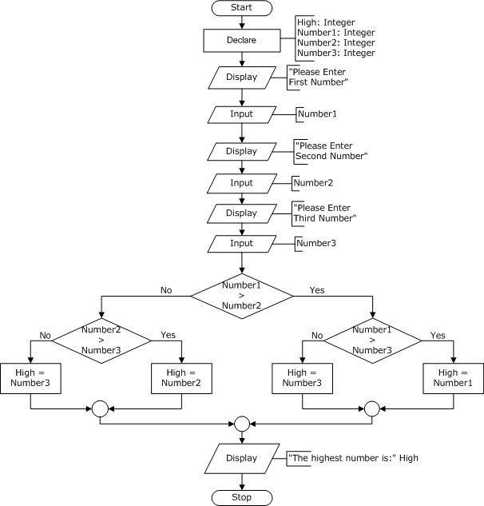

# If-Else Practice

Here are some samples to practice coding the if-else structure.

## Exercise 1

## Exercise 2

## Exercise 3

## Exercise 4

## Exercise 5

## Exercise 6

Create a program that asks the user for the numerator and denominator of a fraction. Then tell the user if it is or is not an **improper** fraction
